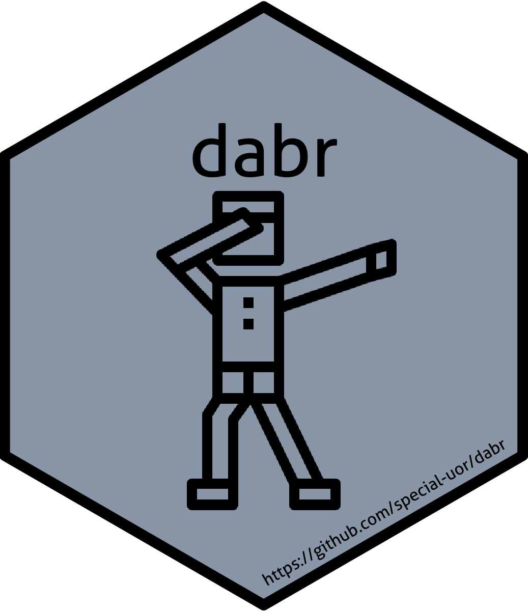

<!-- README.md is generated from README.Rmd. Please edit that file -->

```{r, include = FALSE}
knitr::opts_chunk$set(
  collapse = TRUE,
  comment = "#>",
  fig.path = "man/figures/README-",
  out.width = "100%"
)
```

# dabr: Database Management with R 

<!-- badges: start -->
`r badger::badge_devel("special-uor/dabr", "yellow")`
`r badger::badge_github_actions("special-uor/dabr")`
`r badger::badge_cran_release("dabr", "black")`
<!-- badges: end -->

The goal of dabr is to provide functions to manage databases: select, update, insert,
    and delete records, list tables, backup tables as CSV files, and import
    CSV files as tables.

## Installation

You can install the released version of dabr from [CRAN](https://CRAN.R-project.org) with:

``` r
install.packages("dabr")
```

And the development version from [GitHub](https://github.com/special-uor/dabr) with:

``` r
# install.packages("remotes")
remotes::install_github("special-uor/dabr")
```
## Example
