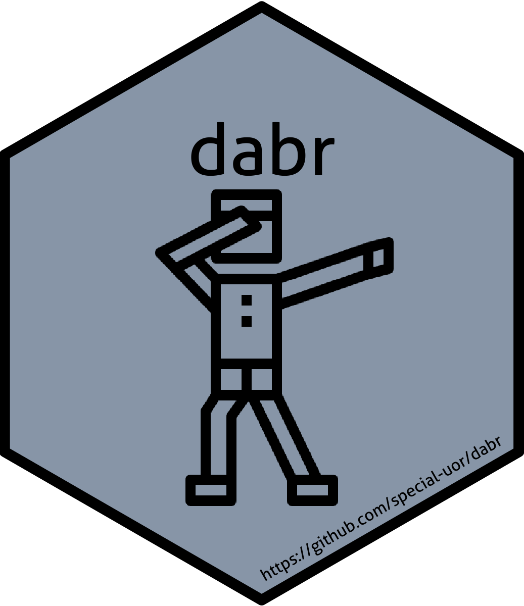

<!-- README.md is generated from README.Rmd. Please edit that file -->

# dabr: Database Management with R 

<!-- badges: start -->

[](https://github.com/special-uor/dabr)
[](https://github.com/special-uor/dabr/actions)
[](https://cran.r-project.org/package=dabr)
<!-- badges: end -->

The goal of dabr is to provide functions to manage databases: select,
update, insert, and delete records, list tables, backup tables as CSV
files, and import CSV files as tables.

## Installation

You can install the released version of dabr from
[CRAN](https://CRAN.R-project.org) with:

``` r
install.packages("dabr")
```

And the development version from
[GitHub](https://github.com/special-uor/dabr) with:

``` r
# install.packages("remotes")
remotes::install_github("special-uor/dabr")
```

## Example
